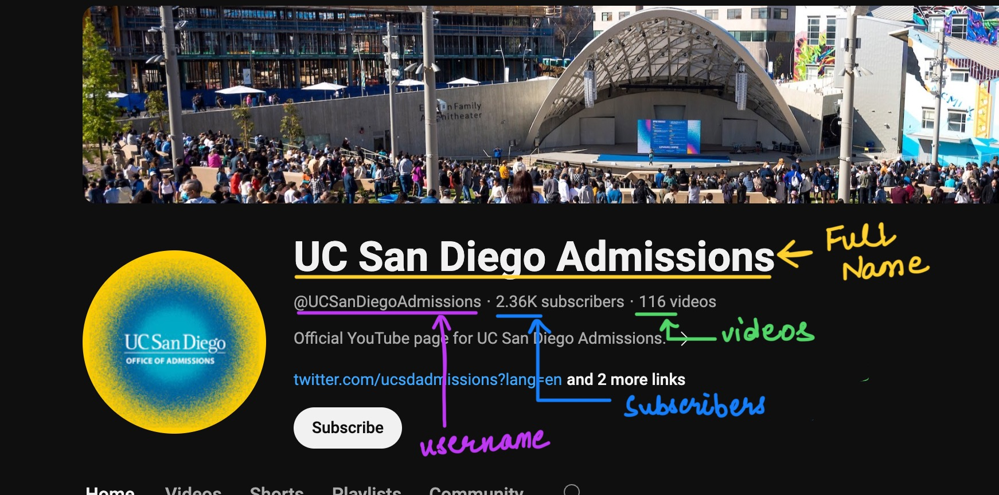
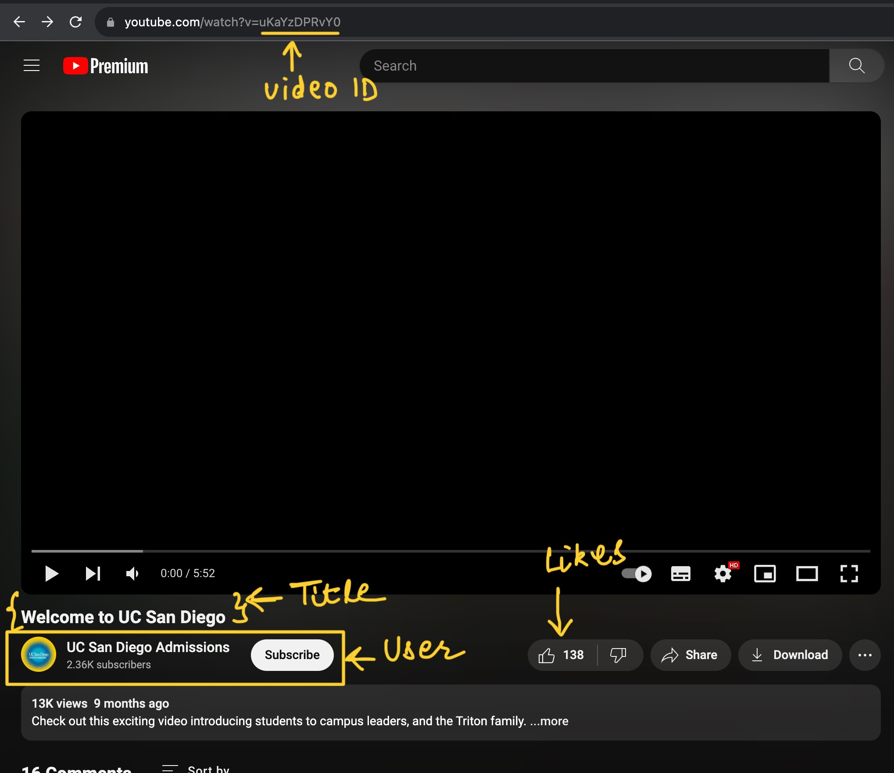

# Programming Assignment 2

### Due Date: Wednesday, January 24, 8:00AM Pacific Time

## Learning Goals

- Write and use classes to represent real world data, and relations between them
- Write methods that make decisions

## Collaboration

Different assignments in this course have different collaboration policies. On
this assignment, you can collaborate with anyone in the course, including
sharing code. In your submission, give credit to all students and course staff
who helped you with this assignment by noting their name and how you used their
ideas or work. **Note that using someone's work without giving credit to them is a
violation of academic integrity.**

# Starter Code

You can download the starter code for this assignment here:

[https://github.com/ucsd-cse11-w24/cse11-pa2-starter](https://github.com/ucsd-cse11-w24/cse11-pa2-starter)

# Start Early!

Start working on the assigment early. Even an hour a day can be very helpful to make sure you finish before the deadline.

## Part 1

`CompileTimeErrors.java` has a method and 3 tests. The code has several compile time errors. Fix the errors so that the code satisfies the following:
1. method `checkNumber()`
  - takes a `double` called `myNumber` as its parameters
  - checks if `myNumber` is positive, negative, or zero, and returns the information as `String` type.
    - If positive: the return message should be `"The number [myNumber] is positive."`
    - If negative: the return message should be `"The number [myNumber] is negative."`
    - If zero: the return message should be `"The number is zero."`
    
    For example, `checkNumber(3.5)` returns `"The number 3.5 is positive."`
2. field `answer1`: tests the result of `checkNumber()` with argument 1
3. field `answer2`: tests the result of `checkNumber()` with argument 0
4. field `answer3`: tests the result of `checkNumber()` with argument -10.5

## Part 2

You will write all your code and comments in `ExampleVideos.java`. This file will contain all three classes that you write, including
`Video`, `User`, and `ExampleVideos`.

In this programming assignment, you will be using data from youtube and
representing them using objects. The choices we make will be similar to those
in many video streaming platforms. You will be making two classes for
implementation and one example class for testing your implementation.
Altogether, you will create 3 classes in one file, and around a dozen objects.

### `User`

The class `User` represents users, the authors of Videos/or just a User watching videos.

- **Data**: A `User` should contain the username of the account, the
display name (also called full name) of the account, the number of subscribers,
and the number of videos posted by the account
(there is more information we could store, but this is enough for some
interesting work)
- **Constructor**: A standard constructor that takes a value for each field and
initializes it. **NOTE: PLEASE MAKE SURE THAT THE ORDER OF THE PARAMETERS IN THE CONSTRUCTORS IS IN THE ORDER AS DESCRIBED IN THE TEXT (1. username, 2. display name, 3. number of subscribers, 4. number of videos), IF YOU CHANGE THIS ORDER, THEN YOUR CODE WON'T PASS ON GRADESCOPE AUTOGRADER**
- **Methods**:
  - `String toText()`
    
    Takes no arguments and returns a string which contains the fullname followed
    by the username of the user, with a space between them and an `"@"` before
    the username, for example: `“UC San Diego Admissions @UCSanDiegoAdmissions”`

Note: To get information about the user (when creating user
objects) you will have to go to their profile and see how many subscribers they
have and then instantiate a new object with that value.

{:width="100%"}

### `Video`

The class `Video` represents a single video posted on youtube.

- **Data**: A `Video` should contain the title of the video,
a reference to the `User` who posted the video, the count of likes the video has, and a
unique id for the Video represented as a String.
- **Constructor**: A standard constructor that takes a value for each field and
initializes it. **NOTE: PLEASE MAKE SURE THAT THE ORDER OF THE PARAMETERS IN THE CONSTRUCTORS IS IN THE ORDER AS DESCRIBED IN THE TEXT (1. title, 2. User, 3. number of likes, 4. unique video id), IF YOU CHANGE THIS ORDER, THEN YOUR CODE WON'T PASS ON GRADESCOPE AUTOGRADER**
- **Methods**:
  - `boolean longerThan(Video other)`
  
    Takes an object of `Video`, and returns true if the title of `this` one is
    longer (has more characters) than the title of `other`.
    
  - `boolean moreLikes(Video other)`

    Takes an object of `Video`, and returns true if the number of likes of `this` video is more
    than the likes of `other`.

  - `String toText()`

    Returns a String that represents the Video object with all the User
    information as text, and also displays the video description and likes.
    The returned string should have the `toText` of the user followed by the
    description, followed by the number of likes, as in this example:
    `"UC San Diego Admissions @UCSanDiegoAdmissions : Welcome to UC San Diego : 138 Likes"`

  - `String toLink()`

    This method returns a string representing the URL for the Video
    Example output: `"https://www.youtube.com/watch?v=uKaYzDPRvY0"`

{:width="100%"}

### `ExampleVideos`

The `ExampleVideos` class is for testing your own implementation.

In order to test your classes and methods, find four videos from
youtube.com with the following properties:

- Two of them are from the same user
- The other two are from two different users

You may find these accounts useful and relevant for finding some fun videos:

- [https://www.youtube.com/@JacobsSchoolNews](https://www.youtube.com/@JacobsSchoolNews)
- [https://www.youtube.com/@Fireship](https://www.youtube.com/@Fireship)
- [https://www.youtube.com/@techroastshow](https://www.youtube.com/@techroastshow)
- [https://www.youtube.com/@SciShow](https://www.youtube.com/@SciShow)

(If you can’t go to Youtube for some reason, let us know via Piazza or email and
we’ll help you out).

In your test class `ExampleVideos`, you will construct User objects and Video
objects corresponding to these four videos you found.  In your test file
`ExampleVideos.java`, you will call each method you write at least twice using
the objects you constructed to build these examples. Since there are 5 methods,
you should have at least 10 method calls total to test your work (every
method should be called at least twice). For each video you found, write a
comment before the line where you construct it with:

- A link to the Video
- An answer to this question: "Were there any parts of the Video class that you couldn’t
represent with the class design we chose?"

For checking off your work, you should have:

- 2 classes, each with fields as described above
- 5 total methods (one in `User` and four in `Video`)
- 2 examples for each method (10 total examples)
- Four `Video` objects with the link and question above answered
- Three `User` objects (to use to construct the Videos)

## Submission Checklist
- [ ] CompileTimeErrors.java
    - [ ] checkNumber method
    - [ ] 3 tests
- [ ] ExampleVideos.java
    - [ ] User class
        - [ ] toText method
    - [ ] Video class
        - [ ] longerThan method
        - [ ] moreLikes method
        - [ ] toText method
        - [ ] toLink method
    - [ ] ExampleVideos class
        - [ ] 4 real videos
            - [ ] 2 from the same user
                - [ ] Link to the videos (2 total)
                - [ ] Answer to the question: "Were there any parts of the Video that you couldn’t represent with the class design we chose?" (2 total)
            - [ ] 1 from different user
                - [ ] Link to the video (1 total)
                - Answer to the question: "Were there any parts of the Video that you couldn’t represent with the class design we chose?" (1 total)
            - [ ] 1 from different user separate from previous users
                - [ ] Link to the video (1 total)
                - Answer to the question: "Were there any parts of the Video that you couldn’t represent with the class design we chose?" (1 total)
        - [ ] Testing
            - [ ] 2 tests for User toText method
            - [ ] 2 tests for Video longerThan method
            - [ ] 2 tests for Video moreLikes method
            - [ ] 2 tests for Video toText method
            - [ ] 2 tests for Video toLink method

You will submit two files to the PA2 assignment:
- `CompileTimeErrors.java` and `ExampleVideos.java` to Gradescope for the [PA2
assignment](https://www.gradescope.com/courses/696684/assignments/3941379/).

## Grading

There are multiple oppurtunities to get feedback for PA2. By submitting before the deadline, you will receive feedback after it is graded shortly after the deadline. You may also submit to the Late/Resubmit for PA2 one time after the deadline to earn additional feedback.

For more information about the grading policy, visit the [course syllabus](https://ucsd-cse11-w24.github.io/syllabus.html).
