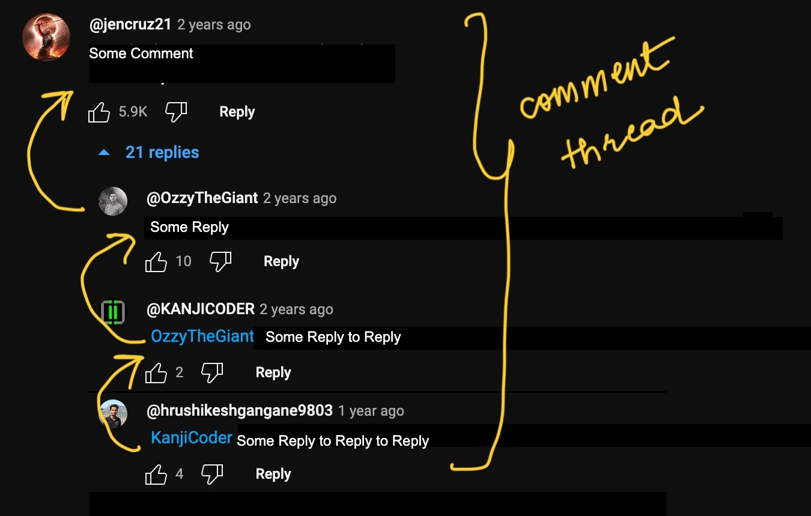

# Programming Assignment 4

### Due Date: Wednesday, February 7, 8:00AM Pacific Time

## Learning Goals 
- practice writing interfaces and classes

## Collaboration
Different assignments in this course have different collaboration policies. On
this assignment, you can collaborate with anyone in the course, including
sharing code. In your submission, give credit to all students and course staff
who helped you with this assignment by noting their name and how you used their
ideas or work. Note that using someone's work without giving credit to them is a
violation of academic integrity.

# Starter Code

You can get the starter code at

[https://github.com/ucsd-cse11-w24/cse11-pa4-starter](https://github.com/ucsd-cse11-w24/cse11-pa4-starter)

## Submission Checklist
- [ ] Youtube.java
- [ ] ExamplesNumber.java

## Youtube

In a file `Youtube.java`, let's start by creating a class called `User`. 
The class `User` represents users, who are the authors of Videos/or just a User watching videos.

A `User` contains two fields:
- `username`, which is a String
- `displayName`, which is a String

Let's talk about Comment Threads on YouTube:

{:width="100%"}
(Modified from https://www.youtube.com/watch?v=U3aXWizDbQ4&t=3s)

This is an example comment thread from Youtube. In Youtube, when a someone replies to a reply - the username of the user you are replying to is the first word in the reply comment. This is a chain of 4 comments, that will correspond to the same comment thread, because each user is replying to a previous reply. We would try to create such a chain of comments through our code now.

To achieve this, we write an `interface` called `Comment` with three
methods inside `Youtube.java`:

- `public boolean isCommentByAuthor(User author);`
- `public int totalLikes();`
- `public String unrollCommentThread();`

*Here: Keyword "public" is an access modifier that defines the visibility or accessibility of a class, method, or field. It specifies that the method can be accessed from outside the class in which it is declared.*

Then, write two classes inside `Youtube.java`:

- `VideoComment`, implements `Comment` and has four fields:
  - `text`, a `String`
  - `likes`, an int
  - `replies` an int
  - `author`, a `User`

*NOTE: PLEASE MAKE SURE THAT THE ORDER OF THE PARAMETERS IN THE CONSTRUCTORS IS IN THE ORDER AS DESCRIBED IN THE TEXT (1. text, 2. likes, 3. replies, 4. author), IF YOU CHANGE THIS ORDER, THEN YOUR CODE WON'T PASS ON GRADESCOPE AUTOGRADER*

  The `VideoComment` is used for the main comment on the video. This class should implement the methods as follows:
  - `isCommentByAuthor` should return `true` when the given author (in the argument) is the
  same as the `author` of this `VideoComment`, `false` otherwise.
  - `totalLikes` should return the number of likes on this `VideoComment` object
  - `unrollCommentThread` should return a string in the following format:

    ```
    <author username>
    <l> likes; <r> replies 
    <text>
    ```

    where `<author>` is replaced by the author's name, `<l>` is replaced by
    the number of likes on the `VideoComment`, `<r>` is replaced by
    the number of replies on the `VideoComment` and `<text>` is replaced by
    the text of the Comment. The string should end in a new line (`"\n"` character).

  It should also add a new method `public int totalInteractions();`. This method takes in
  no arguments, and return the sum of total number of replies and likes for the given Comment.

- `ReplyComment`, which **should implement `Comment`** and has four fields:
  - `text`, a `String`
  - `likes`, an int
  - `author`, a `User`
  - `replyTo`, a `Comment`

*NOTE: PLEASE MAKE SURE THAT THE ORDER OF THE PARAMETERS IN THE CONSTRUCTORS IS IN THE ORDER AS DESCRIBED IN THE TEXT (1. text, 2. likes, 3. author, 4. replyTo), IF YOU CHANGE THIS ORDER, THEN YOUR CODE WON'T PASS ON GRADESCOPE AUTOGRADER*

  This class should implement the methods as follows:
  - `isCommentByAuthor` should return `true` when the given author is the
  same as the `author` of this `ReplyComment` **and** the `replyTo` Comment is
  also by the same author.
  - `totalLikes` should return the total number of likes on this `ReplyComment` object
  **plus** the total likes of its `replyTo` Comment.
  - `unrollCommentThread` should return a string in the following format:

    ```
    <replyTo contents>
    <author username>
    <l> likes
    <text>
    ```

    where the bottom three parts are the same format as in `VideoComment`, and
    the first part is the unrolled version of the `replyTo` `Comment`.
    Similar to the method in `VideoComment`, this should also end in a new line character.

We observe the interesting property here when someone is replying to a Reply. In that case, `unrollCommentThread` will keep calling it's replyTo counterpart until it reaches the root of the comment thread (as it will call the `unrollCommentThread` method of `ReplyComment`, and thus always calling the `replyTo`'s `unrollCommentThread`, which might again call this if it is a `ReplyComment`, and so on, until it reaches the `replyTo` of a `VideoComment`), that will be the main comment on the Video itself. So this design is pretty useful in implementing a comment thread. 

Let's say we have the following example - 

```
User u1 = new User("test_username1", "Test User Full Name 1");
User u2 = new User("test_username2", "Test User Full Name 2");

Comment vc = new VideoComment("This is a great example to use the Tester Library!", 10, 5, u1);
Comment rc1 = new ReplyComment("Yeah, I agree!", 7, u2, rc1);
Comment rc2 = new ReplyComment("Thanks for acknowledgment!", 4, u1, rc2);
```

Then, the output of `unrollCommentThread` will be the following:

```
test_username1
10 likes; 5 replies
This is a great example to use the Tester Library!
test_username2
7 likes
Yeah, I agree!
test_username1
4 likes
Thanks for acknowledgment!
```

You can, but don't have to, use an abstract class to avoid duplicated work as
you see fit. Add constructors as appropriate to initialize the fields on
objects of these classes (whether or not you use an abstract class).

For each method, write at least two tests for it in a class called `Youtube`
using the `Tester` library. A “test” is a use of `checkExpect` that 
checks the results of the method call against an expected value.

For example, let's say we want to test `getTotalLikes()` using the `Tester` library. The following will help us achieve this for the example given before:

```
void testTotalLikes(Tester t) {
        t.checkExpect(this.vc.totalLikes(), 10);
}
```

Since there are 7 total method implementations, you should have at least 14
tests. Tests are graded manually, your implementation is graded
automatically.

## Numbers

This code will go in the file `ExamplesNumber.java`. You will write any tests in a
class called `ExamplesNumber` that you need to add to that file.

We saw in our reading that representing fractional numbers like 0.6 with
doubles can be fraught. Some languages and libraries do support exact
fractions, and we can implement classes that act like them in Java. We won't
be able to use the built-in `+` and `*` operators, because these are only
defined for numbers and strings, but we can define methods for the operations
we care about. We can represent numbers with an interface:

```
interface Number {
  int numerator();
  int denominator();
  Number add(Number other);
  Number multiply(Number other);
  Number getMax(Number other);
  String toString();
  double toDouble();
}
```

(We could specify more methods, but for the purposes of this assignment,
these seven will be sufficient.)

Your task is to create two classes that implement the interface above. One
should be called `WholeInteger` and represent whole integers (including
negative numbers). The other should be called `Fraction` and represent mixed
numbers. Because both Whole Integers and Fractions are Numbers only, we can
user our Numbers interface with different implementations to define the two
classes. 

`WholeInteger` should have:
- A field `int n` and a constructor that takes a single `int`
- An implementation of all the methods declared by the interface Number:
  - `numerator` should return the value of `n`
  - `denominator` should always return `1`
  - `add` should return a new `Number` that represents adding this whole integer to the Number `other` provided as an argument. Note that the argument could be either a `Fraction` or a `WholeInteger`
  - `multiply` should return a new `Number` that represents multiplying this whole integer to the one provided as an argument. Note that the argument could be either a `Fraction` or a `WholeInteger`
  - `getMax` should should return the `Number` which is the **larger** of this  whole integer, or the number provided as an argument. Note that the argument could be either a `Fraction` or a `WholeInteger`. If both are equal, return this.
  - `toString` should return the value of `n` as a `String`, so if `n` is `500`, it should return `"500"`
  - `toDouble` should return the value of `n` as a `double`

`Fraction` should have:
- A field `int n` representing the numerator
- A field `int d` representing the denominator
- An implementation of all the methods declared by the interface Number:
  - `numerator` should return the value of `n`
  - `denominator` should return the value of `d`
  - `add` should return a new `Number` that represents adding this fraction to the Number `other` provided as an argument. Note that the argument could be either a `Fraction` or a `WholeInteger`
  - `multiply` should return a new `Number` that represents multiplying this fraction by the one provided as an argument. Note that the argument could be either a `Fraction` or a `WholeInteger`
  - `getMax` should should return the `Number` which is the **larger** of this fraction, or the number provided as an argument. Note that the argument could be either a `Fraction` or a `WholeInteger`. If both are equal, return this.
  - `toString` should return a `String` in the format `"n/d"` where `n` and `d` are the corresponding fields. So if `n` and `d` were `1` and `2`, this should be `"1/2"`
  - `toDouble` should return the value of `n/d` as a `double`. So if `n` is 1 and `d` is 2, this should return `0.5`

A reminder about arithmetic and fractions:


Some Possible Scenarios that you will encounter:
1. WholeInteger + Fraction: You can assume that a Fraction is something that can't be represented as a WholeInteger. For example: 9/3 will never be a valid Fraction, as 9/3 = 3, which can be represented as a WholeInteger. So, a Fraction + WholeInteger will always result in a Fraction.
2.  WholeInteger * Fraction: This can result in a WholeInteger, or a Fraction. You should tackle this case accordingly, and return a WholeNumber if the denominator reduces to 1, else return a Fraction.
3.  Fraction * Fraction or Fraction + Fraction: This can result in a WholeInteger, or a Fraction. You should tackle this case accordingly, and return a WholeInteger if the denominator reduces to 1, else return a Fraction.
4.  You don't need to return the fraction in it's simplest form except the case when a Conversion happens. Only when a conversion happens, that is, when a fraction can be converted to a whole number, then you need to reduce and return the result accordingly. In other cases, you should return the fraction in its non simplest form only.

### Exploration

At the end of the `ExamplesNumber` class in a place marked clearly with a
comment that says `// Exploration`, write code to perform four calculations:

1. The result of `0.1 + 0.2 + 0.3` using built-in `double` arithmetic in Java
2. The result of `0.1 + (0.2 + 0.3)` using built-in `double` arithmetic in Java
3. The result of (1) using your exact fractions, showing the result via `toString()`
4. The result of (2) using your exact fractions, showing the result via `toString()`

## Submission

Then you will submit _all_ of your files to the `pa4` assignment on Gradescope:

- On the Gradescope upload screen, you can keep clicking “Browse Files” to
  select more than one file for your upload; you can select them one at a time
  or use your operating system's multi-select (Shift-Click usually works) to
  select them all and drag them onto the upload area, or other options that you
  find that work.
- You can also make a zip archive of all of your files and upload them all at
  once if you prefer.

We will automatically grade the correctness of the methods and classes you
write. Tests and exploration sections will be graded manually.  In addition, we
may give you feedback on any part of the code, including automatically graded
parts, that we want you to respond to after grading.

## Extra Challenges (not for credit)

**Challenge** (not required for credit): 
*Note: Conversion from Fraction to a WholeInteger is required for credit as specified above (If and when possible, but converting a fraction to simplest form when it won't be converted to WholeInteger is not required.)*

Many fractions, like $$2/4$$ or $$27/6$$, are not in their simplest form. Make it so that the constructor for
`Fraction` always creates a fraction object with numerator and denominator in
their most reduced form.

## FAQ
1. Why is the autograder producing this error “…” for me?
- As a general reminder, it would help us a lot if your provide your submission link when it's a Gradescope-related question (just copy the URL from the URL bar when looking at your submission and other students won't be able to see your code from a Gradescope link).
- In addition, you should have your own tests, and you should write your own tests and try things out to make sure you understand what your code does before submitting it. You can share your tests with us privately on Piazza and we can discuss what's happening in them as a way to debug as well.

2. My code does not run on Gradescope because it’s still WIP. How can I check that the part I finished is correct?
- For the methods you haven’t finished yet, you can put implementations for them that intentionally return the wrong answer, like an empty string or false, to make it so all the tests will run.

3. VSCode is red underlining the `import tester` statement. Is this an error?
- Before trying to assess the error, try compiling your code and running it. Sometimes VSCode will erroneously underline imports that actually do work. If the code does not compile, make sure that the file that is trying to import the tester is in the same folder as `tester.jar`. 

4. For `unrollCommentThread` methods in `Youtube.java`, I cannot pass the tests on Gradescope, but the expected result and my program result look exactly the same.
- This is probably because of a missing or extra newline character or space character that is hard to spot with our eyes. The autograder has been updated to give a hint:"(Hint) If your result looks the same as the reference output but still gets an error, there may be extra space characters or newline characters in your result. You may try to print the length of your output String locally to see if it matches your expectation." 

5. I wrote test methods with the `Tester`, but `./run` is telling me that no tests ran.
- `Tester` methods have to start with "test" at the beginning!  like
`boolean testAdd(Tester t) { .... }`

6. Am I required to write tests in the `ExamplesNumber` class?
- We won't grade tests written there, but we encourage you to write them to gain confidence in your code!

7. Should the `unrollCommentThread` method of `ReplyComment` start with just the contents of the `replyTo` Comment, or the entire unrolled comment?
- It should contain the entire unrolled comment, not just the `text` field.

8. In class `ReplyComment`, should be field `replyTo` be a `VideoComment` object instead of a `Comment`?
- replyTo field should be of type Comment. Since VideoComment and ReplyComment both implement the Comment interface, VideoComment and ReplyComment both have a shared type called Comment. (Like for example in the class we saw CircleRegion and SquareRegion were both of type Region.). Though, on Youtube a new thread is not started on Replying to a Reply, however on some other platforms you have an option to reply on a reply (like Instagram). So, this is a better design choice that can incorporate both the situations.
